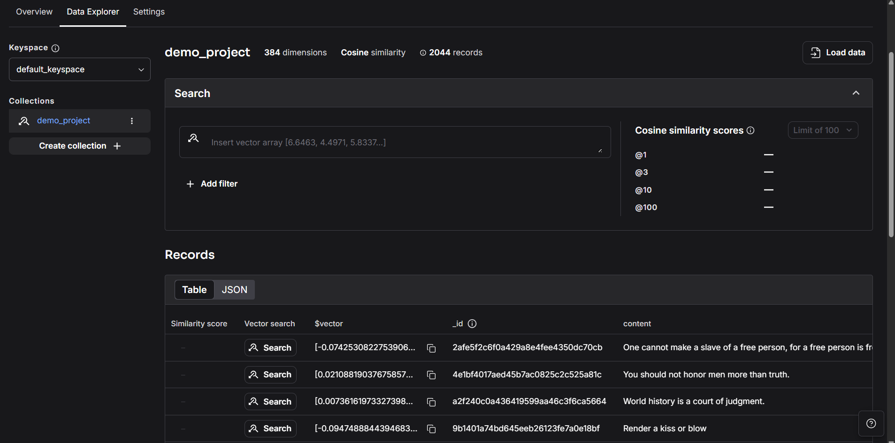
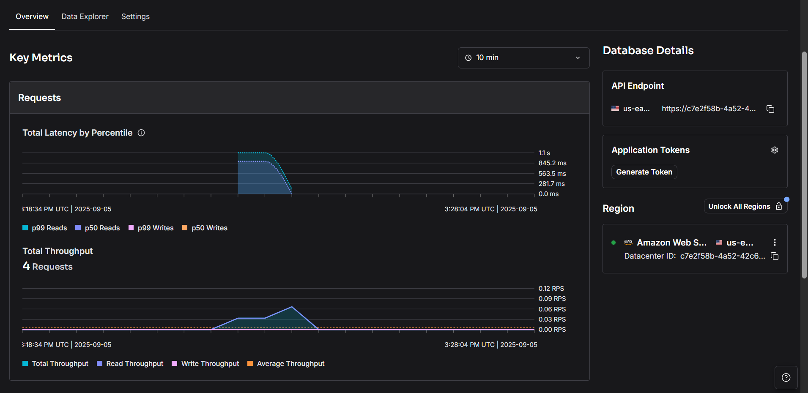

# Exploring Vector Databases with Astra DB

This project demonstrates the use of **Astra DB**, a serverless vector database, to store and query philosophical quotes using vector embeddings. Below, I outline what I learned, focusing on Astra DB, its differences from other vector databases like ChromaDB and FAISS, and how to monitor vectors and metrics such as throughput in the Astra DB UI.

## What I Learned

### 1. **Introduction to Astra DB**
Astra DB is a cloud-native, serverless database built on Apache Cassandra, designed to handle structured, unstructured, and vector data efficiently. In this project, I used Astra DB as a **vector store** to store embeddings of philosophical quotes generated by the `sentence-transformers/all-MiniLM-L6-v2` model from Hugging Face. These embeddings allow for semantic similarity searches, enabling retrieval of relevant quotes based on user queries.

Key takeaways:
- **Serverless Architecture**: Astra DB eliminates the need to manage infrastructure, scaling automatically based on demand.
- **Vector Capabilities**: It supports vector embeddings, making it suitable for AI-driven applications like semantic search, recommendation systems, and RAG (Retrieval-Augmented Generation).
- **Integration with LangChain**: The `langchain_astradb` library simplifies integration, allowing seamless interaction with Astra DB for vector storage and retrieval.

### 2. **How Astra DB Differs from ChromaDB and FAISS**
While ChromaDB and FAISS are popular vector databases, Astra DB offers unique advantages, particularly for cloud-based and enterprise-grade applications. Here's a comparison:

| Feature                     | Astra DB                              | ChromaDB                              | FAISS                                |
|-----------------------------|---------------------------------------|---------------------------------------|--------------------------------------|
| **Architecture**            | Cloud-native, serverless, built on Cassandra | In-memory or disk-based, local or self-hosted | In-memory, local library for vector search |
| **Scalability**             | Auto-scales with demand, no manual intervention | Manual scaling, limited by host resources | Limited by local hardware, no auto-scaling |
| **Vector Support**          | Native vector storage and similarity search | Optimized for vector storage and retrieval | High-performance vector similarity search |
| **Deployment**              | Fully managed, cloud-based (DataStax) | Self-hosted or embedded in applications | Embedded library, requires integration |
| **Ease of Use**             | Simple setup via API keys and UI | Easy for local prototyping | Requires more setup for production use |
| **Enterprise Features**     | Security (RBAC, encryption), global replication | Limited enterprise features | Minimal, focused on search performance |
| **Metrics Monitoring**      | Rich UI with throughput, latency, and vector analytics | Limited or no built-in UI for metrics | No UI, requires custom monitoring |
| **Use Case**                | Enterprise AI, RAG, large-scale apps | Small-scale AI, prototyping | High-performance, research-oriented apps |

**Why Astra DB Stands Out**:
- **Global Scalability**: Astra DB's serverless nature and Cassandra backbone ensure it can handle massive datasets and high throughput across regions without manual configuration.
- **Managed Service**: Unlike ChromaDB and FAISS, which require self-hosting or integration, Astra DB is fully managed, reducing operational overhead.
- **Vector-Specific UI**: Astra DB provides a web-based UI to visualize vectors, query performance, and monitor metrics like throughput and latency, which ChromaDB and FAISS lack natively.

### 3. **Project Workflow**
The project follows a clear flow to set up and query a vector database using Astra DB:

1. **Environment Setup**:
   - Configured environment variables for Astra DB API endpoint and application token.
   - Secured a Hugging Face token for accessing embedding models.

2. **Embedding Generation**:
   - Used `HuggingFaceEmbeddings` with the `sentence-transformers/all-MiniLM-L6-v2` model to generate vector embeddings for philosophical quotes.

3. **Vector Store Initialization**:
   - Initialized an `AstraDBVectorStore` instance with a collection named `demo_project`, linking it to the embeddings and Astra DB credentials.

4. **Data Ingestion**:
   - Loaded the `datastax/philosopher-quotes` dataset, transforming quotes into `Document` objects with metadata (e.g., author, tags).
   - Inserted 292 documents into Astra DB, storing their vector embeddings.

5. **Querying with RAG**:
   - Set up a retrieval pipeline using LangChain's `ChatPromptTemplate`, `HuggingFacePipeline` (with `falcon-7b-instruct` model), and `AstraDBVectorStore` as a retriever.
   - Queried the database to find the most relevant quotes based on semantic similarity (e.g., "What subject are philosophers most concerned with?").

### 4. **Visualizing Vectors and Metrics in Astra DB UI**
Astra DB's web-based UI is a powerful tool for monitoring and managing vector data. Here's how to use it:

- **Accessing the UI**:
  - Log in to the Astra DB dashboard (https://astra.datastax.com).
  - Navigate to your database and select the `demo_project` collection.
  

- **Viewing Vectors**:
  - The UI displays stored documents, including their vector embeddings (high-dimensional arrays).
  - You can inspect individual documents to see their content, metadata (e.g., `author`, `tags`), and associated vectors.
  - Example: For a quote like "The roots of education are bitter, but the fruit is sweet" by Aristotle, the UI shows its embedding vector alongside metadata (`education: y`, `knowledge: y`).

- **Monitoring Metrics**:
  - **Throughput**: Track the number of read/write operations per second to gauge database performance. For example, inserting 292 documents in the project generates write throughput, visible in the UI's metrics tab.
  - **Latency**: Monitor query response times to ensure efficient retrieval for RAG applications.
  - **Usage Analytics**: View storage usage and request rates to optimize costs and performance.
  - The UI's graphs and tables make it easy to identify bottlenecks or spikes in activity.

- **Query Exploration**:
  - Use the UI's query builder to run vector similarity searches manually, testing how well the database retrieves relevant documents for a given query.

### 5. **Key Insights**
- **Ease of Use**: Astra DB's integration with LangChain and its serverless model made setup straightforward compared to self-hosted solutions like ChromaDB.
- **Performance**: The vector store efficiently handled semantic searches, retrieving contextually relevant quotes in milliseconds.
- **Scalability**: Astra DB's cloud-native design ensures it can scale for larger datasets or higher query volumes without manual intervention.
- **Monitoring**: The UI's metrics and vector visualization capabilities provided clear insights into data storage and query performance, a feature absent in ChromaDB and FAISS.

## Getting Started
To replicate this project:
1. **Set Up Astra DB**:
   - Create an account on DataStax Astra DB and generate an application token and API endpoint.
   - Create a database and a collection (e.g., `demo_project`).

2. **Install Dependencies**:
   ```bash
   pip install langchain-astradb langchain-community langchain transformers datasets
   ```

3. **Run the Notebook**:
   - Use the provided `AstraDB_EXP.ipynb` notebook.
   - Update environment variables with your Astra DB and Hugging Face credentials.
   - Execute cells to load data, generate embeddings, and query the vector store.

4. **Monitor in the UI**:
   - Log in to Astra DB's dashboard to view vectors, documents, and performance metrics.
   _UI_
   
   _Metrics_page_
   
## Conclusion
This project showcased Astra DB's power as a vector database for AI-driven applications. Its serverless architecture, seamless LangChain integration, and robust UI for monitoring vectors and metrics make it a compelling choice over ChromaDB and FAISS for scalable, managed solutions. By storing and querying philosophical quotes, I learned how to leverage vector embeddings for semantic search and how Astra DB's cloud-native features simplify development and monitoring.

For more details on Astra DB, visit [DataStax Astra DB](https://www.datastax.com/products/astra-db).